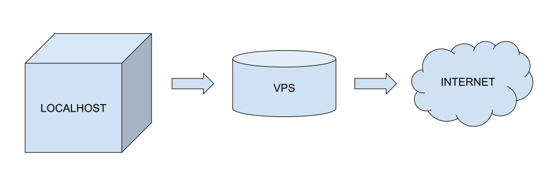

Banyak cara untuk mempublikasikan suatu website langsung dari lokal komputer lokal ke jaringan internet dunia.
Salah satu contohnya adalah menggunakan layanan NGROK atau menggunakan SSH tunelling. 

Dalam artikel ini akan dibahas bagaimana caranya mempublikasikan website di `localhost` komputer ke internet menggunakan SSH tunel dengan fitur Gateway Port.



## Tahapan Publikasi Web dari komputer lokal ke Internet

### 1. Memiliki VPS (Virtual Private Server). 
VPS Free Tier atau gratisan bisa didapatkan melalui `Compute Engine` dari GCP (Google Cloud Platform) atau `EC2` dari AWS (Amazon Web Service).
Atau bisa juga membeli VPS berbayar dengan spec `1 Core CPU`, `1GB RAM`, `20GB Drive` hanya dengan `Rp 50.000` saja perbulan di [Id Cloud Host](https://console.idcloudhost.com)

### 2. Aktifkan Fitur SSH Gateway Ports di VPS
Setelah memiliki VPS, login ke VPS. misal login melalui SSH (dalam kasus, misal alamat IP publik VPS adalah `123.123.123.123` dengan user name `pengguna`).
Login dengan perintah `ssh pengguna@123.123.123.123` atau dengan cara lain yang penting bisa masuk ke dalam VPS di mode CLI.

edit file `/etc/ssh/sshd_config` dengan hak akses root dan tambahkan/edit line `GatewayPorts yes` 

dalam kasus ini. ada beberapa server yang sudah terdapat line `#GatewayPorts no`. rubah line ini menjadi `GatewayPorts yes` (tanpa pagar dan `no` menjadi `yes`)
{:.alert.alert-success}

setelah itu restart service SSH dengan command `service ssh restart` (gunakan `sudo` jika dibutuhkan hak akses root)

### 3. Aktifkan Server di Lokal komputer
Misal di lokal komputer terinstall `LAMPP` atau `XAMPP` dengan port lokal `80` (berarti web bisa dibuka di alamat `http://localhost:80` atau `http://localhost`)

selain `XAMPP` atau `LAMPP`. bisa juga forward service lain dari port berbeda seperti NodeJS atau Django dari port `8000` atau port `5000` atau port lainnya
{:.alert.alert-success}

Perlu di ingat. Pastikan service/server di lokal dapat di buka di browser lokal

### 4. Forward Server Lokal ke Internet dengan SSH tunelling
Forward ke VPS/internet dengan format 

```
ssh -R <PORT_VPS>:<DOMAIN_LOCAL>:<PORT_LOCAL> <USER>@<IP_VPS>
```

Misal port yang di jalankan di lokal adalah port `localhost:80` dan akan di forward ke vps di `123.123.123.123:8000`.
Maka, Login ke server menggunakan command SSH berikut:

```sh
ssh -R 8000:localhost:80 pengguna@123.123.123.123
```

Setelah menjalankan command di atas, kalian akan diminta password atau auto login menggunakan ssh `.key` / `.pem` tergantung settingan server 
{:.alert.alert-success}

command di atas akan membawa kita login ke server melalui SSH. 
setelah berhasil login, buka browser dan buka alamat `123.123.123.123:8000`

Well done! 🎯, alamat web lokal di komputer `localhost:80` sudah bisa di akses oleh publik di dunia dengan alamat `123.123.123.123:8000`
